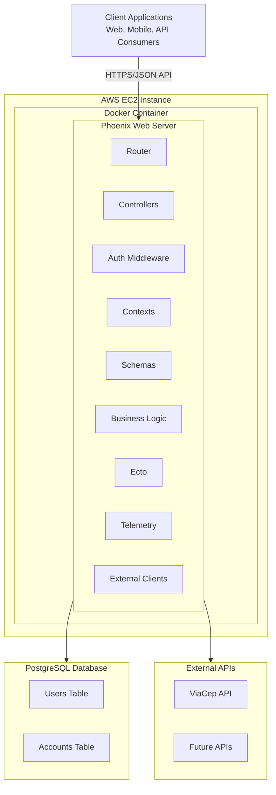
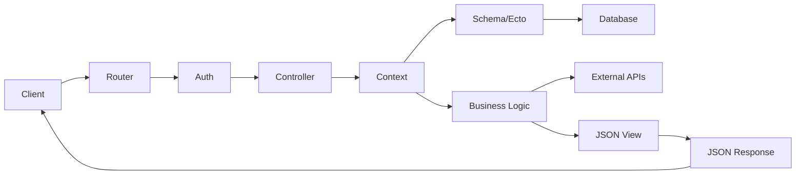
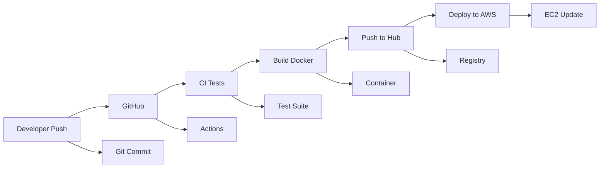
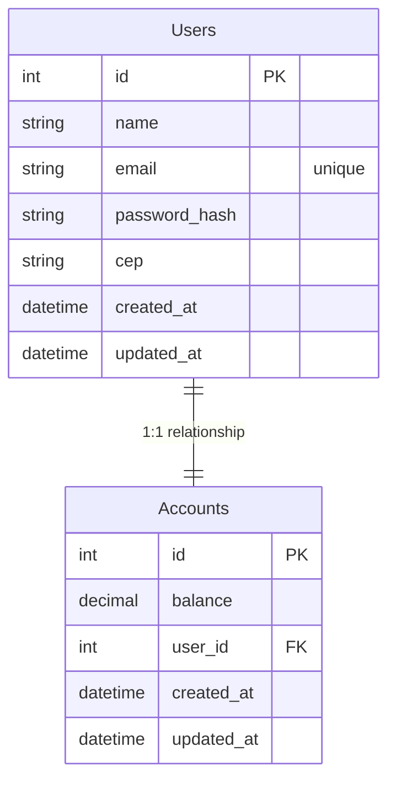

# Architecture Overview

## System Architecture

QuebradoBank is a cloud-native banking API built with Elixir/Phoenix, designed for scalability and reliability. The system follows a layered architecture pattern with clear separation of concerns.

### High-Level Architecture Diagram

## Infrastructure Components

### Cloud Infrastructure
- **AWS EC2**: Production hosting environment
- **Docker Container**: Application containerization
- **PostgreSQL**: Primary database (containerized)
- **GitHub Actions**: CI/CD pipeline automation
- **Docker Hub**: Container registry

### Application Stack
- **Elixir/Phoenix**: Web framework and runtime
- **Ecto**: Database ORM and query builder
- **Cowboy**: HTTP server
- **Phoenix Token**: JWT authentication
- **Tesla**: HTTP client for external APIs
- **Argon2**: Password hashing

## Component Interactions

### Request Flow
1. **Client Request** → API endpoint via HTTPS
2. **Phoenix Router** → Routes to appropriate controller
3. **Auth Middleware** → Validates JWT tokens (for protected routes)
4. **Controller** → Processes request and calls business logic
5. **Context Layer** → Orchestrates business operations
6. **Ecto/Database** → Persists or retrieves data
7. **External APIs** → ViaCep for address validation (when needed)
8. **Response** → JSON response back to client

### Data Flow Architecture

### Security Layers
1. **HTTPS Encryption** - All communication encrypted
2. **JWT Authentication** - Token-based auth for protected endpoints  
3. **Input Validation** - Ecto changesets validate all inputs
4. **SQL Injection Protection** - Ecto parameterized queries
5. **Password Security** - Argon2 hashing for user passwords

## Deployment Architecture

### CI/CD Pipeline

### Production Environment
- **AWS EC2 Instance** running Docker containers
- **Docker Compose** orchestration for multi-service setup
- **PostgreSQL Container** for data persistence
- **Application Container** running Phoenix server
- **Automated Deployment** via GitHub Actions on main branch pushes

## Database Design

### Entity Relationship

### Key Constraints
- One user can have exactly one account (1:1 relationship)
- Account balance must be non-negative (check constraint)
- Email addresses must be unique across users
- User-Account relationship enforced by foreign key constraint

## Scalability Considerations

### Current Architecture Benefits
- **Stateless Application** - Easy horizontal scaling
- **Database Transactions** - ACID compliance for financial operations  
- **External API Isolation** - ViaCep failures don't break core functionality
- **Container-Based** - Easy deployment and scaling

### Future Scaling Options
- Load balancer for multiple application instances
- Database read replicas for improved performance
- Redis for session/cache management
- Message queues for async processing
- Microservices decomposition for specific domains

## Monitoring and Observability

- **Telemetry Integration** - Built-in Phoenix telemetry
- **Database Metrics** - Query timing and performance tracking
- **HTTP Metrics** - Request/response timing and status codes
- **Live Dashboard** - Development environment monitoring (when enabled)

See [External Integrations](integrations.md) for details on external service dependencies and [Features Overview](features.md) for detailed feature architecture.