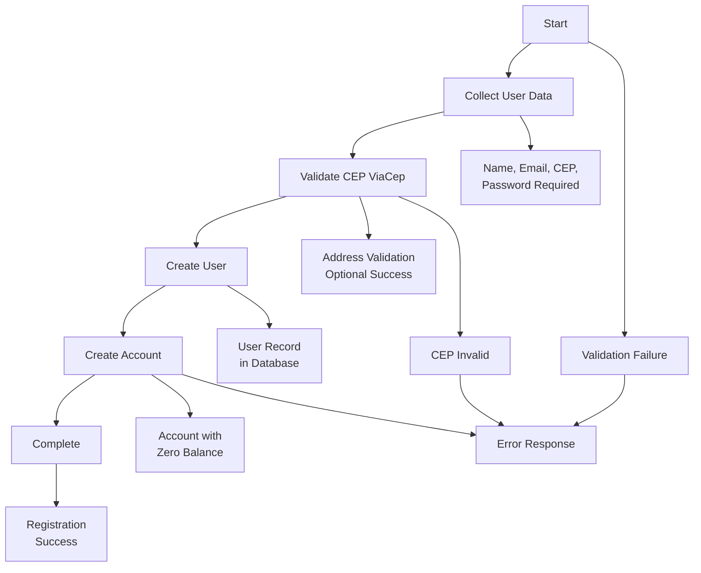
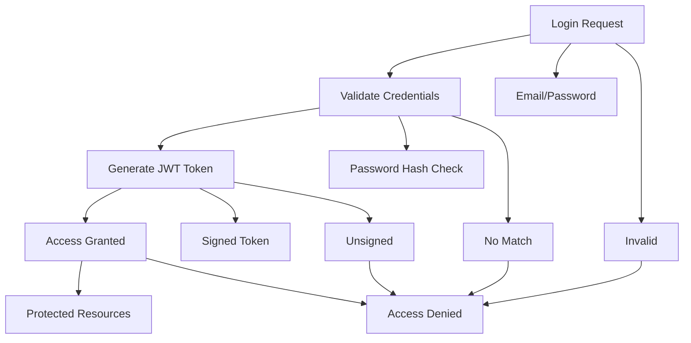
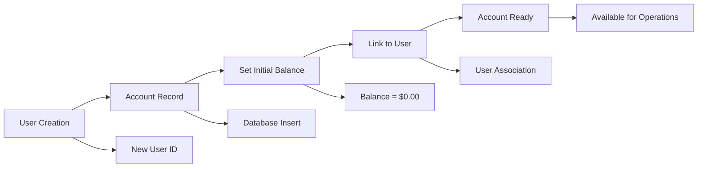
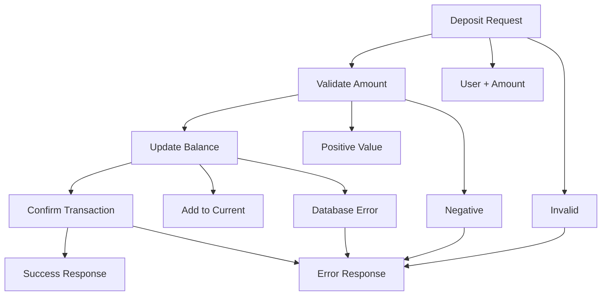
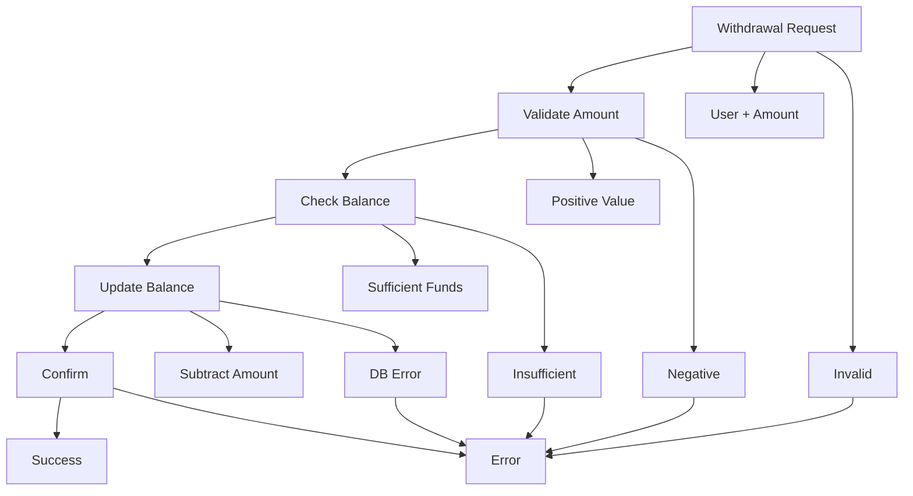
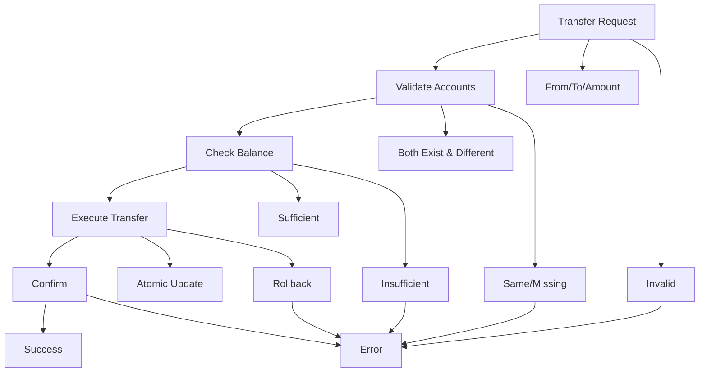

# Core Business Logic

This document outlines the fundamental business processes, rules, and workflows that QuebradoBank implements.

## Business Overview

QuebradoBank is a simplified digital banking platform that provides core banking services for individual users. The system focuses on essential banking operations while maintaining security and data integrity.

## Core Business Rules

### 1. User Management Rules
- **Unique Identity**: Each user must have a unique email address
- **Address Validation**: Users must provide a valid Brazilian postal code (CEP)
- **Password Security**: Passwords must be at least 8 characters long
- **One Account Per User**: Each user can have exactly one bank account

### 2. Account Management Rules
- **Account Creation**: Accounts are automatically created with zero balance
- **Single Ownership**: Each account belongs to exactly one user
- **Balance Integrity**: Account balances cannot be negative
- **Decimal Precision**: All monetary values use decimal precision for accuracy

### 3. Financial Operation Rules
- **Positive Transactions**: All transaction amounts must be positive values
- **Atomic Operations**: All financial transactions are atomic (all-or-nothing)
- **Self-Transfer Prevention**: Users cannot transfer money to their own account
- **Sufficient Funds**: Withdrawals and transfers require sufficient account balance

## Business Workflows

### User Registration Workflow


**Business Rules Applied:**
- Email uniqueness validation
- CEP format and validity checking via ViaCep API
- Password strength requirements
- Automatic account creation with $0.00 balance

### User Authentication Workflow


**Business Rules Applied:**
- Secure password verification using Argon2
- JWT token expiration management
- Session-based access control

### Account Creation Workflow


**Business Rules Applied:**
- One-to-one user-account relationship
- Zero initial balance requirement
- Account ownership integrity

### Financial Transaction Workflows

#### Deposit Workflow


#### Withdrawal Workflow


#### Transfer Workflow


**Transfer Business Logic:**
1. **Account Validation**: Both source and destination accounts must exist
2. **Self-Transfer Prevention**: Cannot transfer to the same account
3. **Balance Verification**: Source account must have sufficient funds
4. **Atomic Execution**: Both debit and credit operations must succeed
5. **Transaction Integrity**: Either both accounts update or neither does

## Business Process Details

### Account Balance Management

#### Balance Calculation Rules
- All balances stored as `Decimal` type for precision
- Minimum balance: $0.00 (enforced by database constraint)
- Maximum balance: No limit currently enforced
- Currency: Implied Brazilian Real (BRL)

#### Transaction Atomicity
```elixir
# Multi-step transaction example
Multi.new()
|> withdraw(source_account, amount)    # Step 1: Debit source
|> deposit(target_account, amount)     # Step 2: Credit target  
|> Repo.transaction()                  # Execute atomically
```

### Data Validation Business Rules

#### User Data Validation
- **Name**: Minimum 3 characters, required
- **Email**: Must contain "@" symbol, must be unique
- **Password**: Minimum 8 characters, hashed with Argon2
- **CEP**: Minimum 5 characters, validated against ViaCep API

#### Financial Data Validation  
- **Transaction Amounts**: Must be positive decimal values
- **Account Balances**: Cannot go below zero
- **Account References**: Must reference existing accounts

### Security Business Rules

#### Authentication Requirements
- **Public Endpoints**: User registration, login, welcome message
- **Protected Endpoints**: All account and transaction operations
- **Token Expiration**: JWT tokens have configurable expiration
- **Password Storage**: Never stored in plain text, always hashed

#### Authorization Rules
- **Account Access**: Users can only access their own account
- **Transaction Authorization**: Users can only perform transactions on their own account
- **Admin Functions**: No admin functions currently implemented

## Error Handling Business Logic

### Validation Error Patterns
- **Input Validation**: Return specific field-level errors
- **Business Rule Violations**: Return descriptive error messages
- **External Service Failures**: Graceful degradation where possible

### Common Business Error Scenarios
1. **Insufficient Funds**: Clear message about available balance
2. **Invalid CEP**: Specific address validation error
3. **Duplicate Email**: User-friendly duplicate account message
4. **Account Not Found**: Generic "not found" for security
5. **Invalid Transaction**: Specific validation rule violation

## Business Metrics and KPIs

### Key Business Metrics
- **User Registration Rate**: New users per time period
- **Account Creation Success**: Percentage of successful account creations
- **Transaction Volume**: Total number and value of transactions
- **Transaction Success Rate**: Percentage of successful financial operations
- **API Response Times**: Performance metrics for user experience

### Business Rule Compliance
- **Balance Integrity**: Zero accounts with negative balances
- **Account Uniqueness**: One account per user maintained
- **Transaction Atomicity**: No partial transaction states
- **Data Consistency**: User-account relationships maintained

## Future Business Logic Considerations

### Potential Enhancements
- **Multiple Account Types**: Checking, savings, credit accounts
- **Interest Calculations**: Automatic interest accrual
- **Transaction Limits**: Daily/monthly transaction limits
- **Account Fees**: Monthly or transaction-based fees
- **Transaction History**: Detailed audit trail and reporting
- **Multi-Currency Support**: Support for multiple currencies

### Regulatory Considerations
- **KYC/AML Compliance**: Know Your Customer and Anti-Money Laundering
- **Transaction Reporting**: Regulatory transaction reporting
- **Data Privacy**: LGPD (Brazilian GDPR) compliance
- **Financial Regulations**: Brazilian banking regulation compliance

See [Features Overview](features.md) for detailed feature implementations and [Architecture Overview](architecture.md) for technical implementation details.