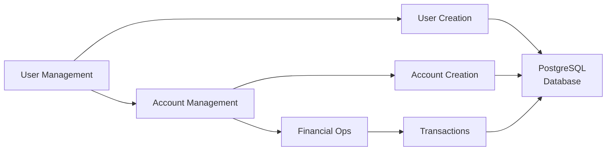
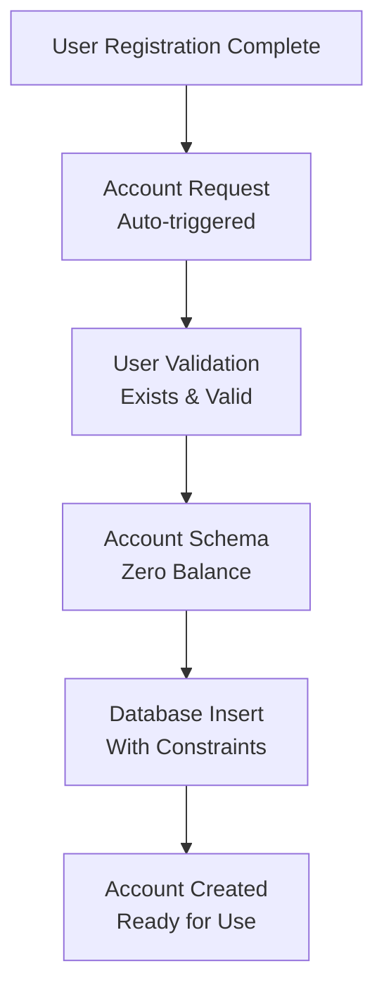

# Account Management Feature

## Overview

The Account Management feature handles bank account creation, maintenance, and information retrieval within QuebradoBank. It establishes the fundamental banking relationship between users and their financial accounts, serving as the foundation for all financial operations.

## Feature Purpose

Account Management enables:
- Automatic account creation for new users
- Account information retrieval and balance checking
- Account lifecycle management
- User-account relationship maintenance

This feature provides the core banking infrastructure that enables all financial transactions and account operations.

## Architecture Integration

### System Context


### Dependencies
- **User Management**: Requires valid user for account creation
- **Database**: PostgreSQL for account data persistence
- **Authentication**: JWT tokens for account access control
- **Financial Operations**: Provides accounts for transaction processing

## Key Workflows

### 1. Account Creation Workflow



**Business Rules Applied:**
- One account per user (unique constraint)
- Initial balance of $0.00
- Account linked to valid user
- Non-negative balance constraint enabled

### 2. Account Information Retrieval

```
Account Info Request
         │
         ▼
┌─────────────────┐
│ Authentication  │
│ (JWT Validation)│
└─────────────────┘
         │
         ▼
┌─────────────────┐
│ User Lookup     │
│ (From Token)    │
└─────────────────┘
         │
         ▼
┌─────────────────┐
│ Account Query   │
│ (User's Account)│
└─────────────────┘
         │
         ▼
┌─────────────────┐
│ Balance & Info  │
│ (Current State) │
└─────────────────┘
```

**Input/Output:**
- **Input**: Valid JWT token
- **Output**: Account ID, balance, timestamps
- **Error Cases**: No account found, authentication failure

### 3. Account Balance Updates

```
Balance Update Request
         │
         ▼
┌─────────────────┐
│ Account Lookup  │
│ (By Account ID) │
└─────────────────┘
         │
         ▼
┌─────────────────┐
│ Balance Calc    │
│ (New Amount)    │
└─────────────────┘
         │
         ▼
┌─────────────────┐
│ Constraint Check│
│ (>= 0 Required) │
└─────────────────┘
         │
         ▼
┌─────────────────┐
│ Database Update │
│ (Atomic)        │
└─────────────────┘
         │
         ▼
    Updated Account
```

## Implementation Details

### Core Components

#### 1. Account Schema (`lib/quebrado_bank/accounts/account.ex`)
```elixir
schema "accounts" do
  field(:balance, :decimal)      # Account balance (precise decimal)
  belongs_to(:user, User)       # One-to-one with user
  timestamps()                  # Created/updated tracking
end
```

**Key Constraints:**
- `balance >= 0` (database constraint)
- `user_id` unique (one account per user)
- Required fields: `balance`, `user_id`

#### 2. Context Module (`lib/quebrado_bank/accounts.ex`)
Provides interface for account operations:
- `create/1` - Account creation
- Balance update operations (used by financial operations)

#### 3. Account Creation Module (`lib/quebrado_bank/accounts/create.ex`)
Handles new account creation with business rule enforcement.

### Database Design

#### Accounts Table Structure
```sql
CREATE TABLE accounts (
  id BIGSERIAL PRIMARY KEY,
  balance DECIMAL NOT NULL DEFAULT 0,
  user_id BIGINT NOT NULL REFERENCES users(id),
  inserted_at TIMESTAMP NOT NULL,
  updated_at TIMESTAMP NOT NULL,
  
  CONSTRAINT balance_must_be_positive CHECK (balance >= 0),
  CONSTRAINT unique_user_account UNIQUE (user_id)
);
```

#### Relationship Constraints
- **Foreign Key**: `user_id` references `users.id`
- **Unique Constraint**: One account per user
- **Check Constraint**: Non-negative balance
- **Not Null**: All required fields enforced

### API Integration

#### Account Creation Endpoint
```http
POST /api/accounts
Authorization: Bearer <jwt_token>
Content-Type: application/json

{
  "user_id": 123
}
```

**Response (Success):**
```json
{
  "id": 456,
  "balance": "0.00",
  "user_id": 123,
  "inserted_at": "2023-08-26T21:57:58Z",
  "updated_at": "2023-08-26T21:57:58Z"
}
```

**Note**: In practice, account creation is typically triggered automatically during user registration.

#### Account Information Retrieval
Account information is typically accessed through user profile endpoints:

```http
GET /api/users/:id
Authorization: Bearer <jwt_token>
```

**Response includes account data:**
```json
{
  "user": {
    "name": "John Doe",
    "email": "john@example.com",
    "cep": "12345-678"
  },
  "account": {
    "id": 456,
    "balance": "150.75",
    "updated_at": "2023-08-26T22:15:30Z"
  }
}
```

## Business Logic Integration

### Account Lifecycle States

```
┌─────────────┐    ┌─────────────┐    ┌─────────────┐
│   Created   │───▶│   Active    │───▶│   Closed    │
│ (Balance=0) │    │ (In Use)    │    │ (Archived)  │
└─────────────┘    └─────────────┘    └─────────────┘
       │                  │                  │
       ▼                  ▼                  ▼
  Initial State      Normal Operations   End of Life
```

**Current Implementation:**
- **Created**: Account created with zero balance
- **Active**: Account with potential balance and transaction history
- **Closed**: Not yet implemented (future enhancement)

### Balance Management Rules

#### Precision Handling
```elixir
# All balances use Decimal type for financial precision
balance = Decimal.new("150.75")  # Exact decimal representation
```

#### Constraint Enforcement
- **Database Level**: `CHECK (balance >= 0)` constraint
- **Application Level**: Validation in changeset
- **Business Logic**: Pre-transaction balance verification

### Integration with Financial Operations

#### Deposit Operations
```elixir
# Account balance update for deposits
new_balance = Decimal.add(current_balance, deposit_amount)
changeset = Account.changeset(account, %{balance: new_balance})
```

#### Withdrawal Operations
```elixir
# Account balance update for withdrawals (with validation)
new_balance = Decimal.sub(current_balance, withdrawal_amount)
# Constraint check ensures new_balance >= 0
changeset = Account.changeset(account, %{balance: new_balance})
```

#### Transfer Operations
```elixir
# Atomic transfer between accounts
Multi.new()
|> Multi.update(:withdraw, debit_changeset)
|> Multi.update(:deposit, credit_changeset)
|> Repo.transaction()
```

## Security and Access Control

### Authorization Rules
- **Account Access**: Users can only access their own account
- **Account Creation**: Authenticated users only
- **Balance Updates**: Only through authorized financial operations
- **Account Information**: Protected by JWT authentication

### Data Privacy
- **Balance Visibility**: Only to account owner
- **Transaction History**: User-specific access (future feature)
- **Account Numbers**: Internal IDs only (no external account numbers yet)

## Edge Cases and Error Handling

### Account Creation Edge Cases
1. **Duplicate Account**: User already has an account (unique constraint violation)
2. **Invalid User**: User doesn't exist (foreign key constraint)
3. **Concurrent Creation**: Race condition handling via database constraints

### Balance Update Edge Cases
1. **Negative Balance**: Prevented by database constraint
2. **Concurrent Updates**: Database-level locking for consistency
3. **Decimal Precision**: Proper decimal handling for financial accuracy
4. **Large Amounts**: No upper limit currently enforced

### Data Integrity Issues
1. **Orphaned Accounts**: Prevented by foreign key constraints
2. **Invalid Balances**: Check constraints ensure data validity
3. **Timestamp Consistency**: Automatic timestamp management

## Performance Considerations

### Database Optimization
- **Indexes**: Primary key and foreign key indexes
- **Constraints**: Database-level constraint checking
- **Connection Pooling**: Ecto connection pool for concurrent access

### Query Optimization
- **User-Account Joins**: Efficient queries for user profile with account
- **Balance Lookups**: Direct account ID queries for transactions
- **Batch Operations**: Potential for bulk account operations

## Testing Strategy

### Unit Testing
- **Account Schema**: Changeset validation and constraints
- **Balance Calculations**: Decimal arithmetic testing
- **Business Rules**: Account creation rule validation

### Integration Testing
- **Database Constraints**: Constraint violation testing
- **User-Account Relationship**: Foreign key testing
- **Transaction Integrity**: Multi-table operation testing

### Edge Case Testing
- **Concurrent Access**: Race condition testing
- **Large Numbers**: High-value balance testing
- **Error Scenarios**: Invalid input handling

## Future Enhancements

### Near-Term Improvements
1. **Multiple Account Types**: Checking, savings, credit accounts
2. **Account Statements**: Balance and transaction history
3. **Account Closure**: Proper account lifecycle management
4. **Account Numbers**: External account number generation

### Advanced Features
1. **Interest Accrual**: Automatic interest calculation for savings
2. **Account Fees**: Monthly or transaction-based fees
3. **Account Limits**: Daily transaction or balance limits
4. **Sub-Accounts**: Joint accounts or business account features

### Technical Improvements
1. **Read Replicas**: Separate read/write database connections
2. **Caching**: Balance caching for high-frequency access
3. **Audit Trail**: Complete account change history
4. **Backup/Recovery**: Account data backup and recovery procedures

## Related Documentation

- [User Management](user-management.md) - User-account relationship setup
- [Financial Operations](financial-operations.md) - Account transaction processing
- [Authentication](authentication.md) - Account access security
- [Business Logic](../business-logic.md) - Account business rules
- [Architecture Overview](../architecture.md) - Database design context