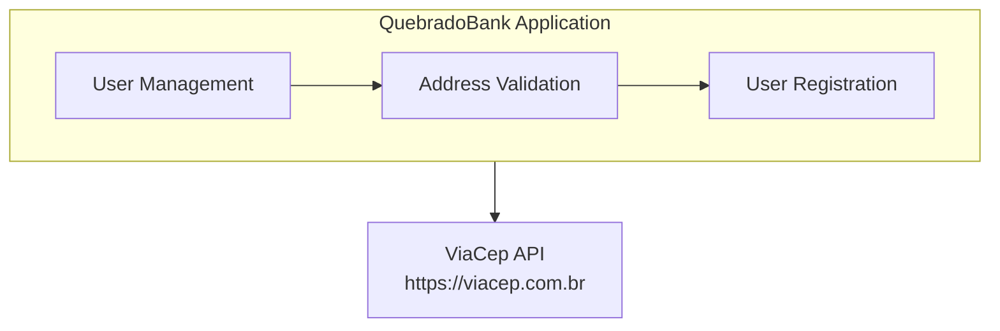
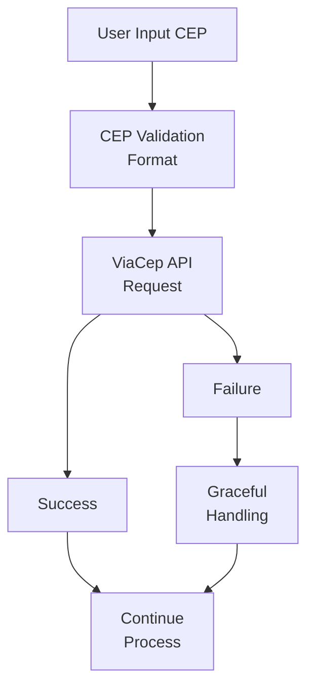
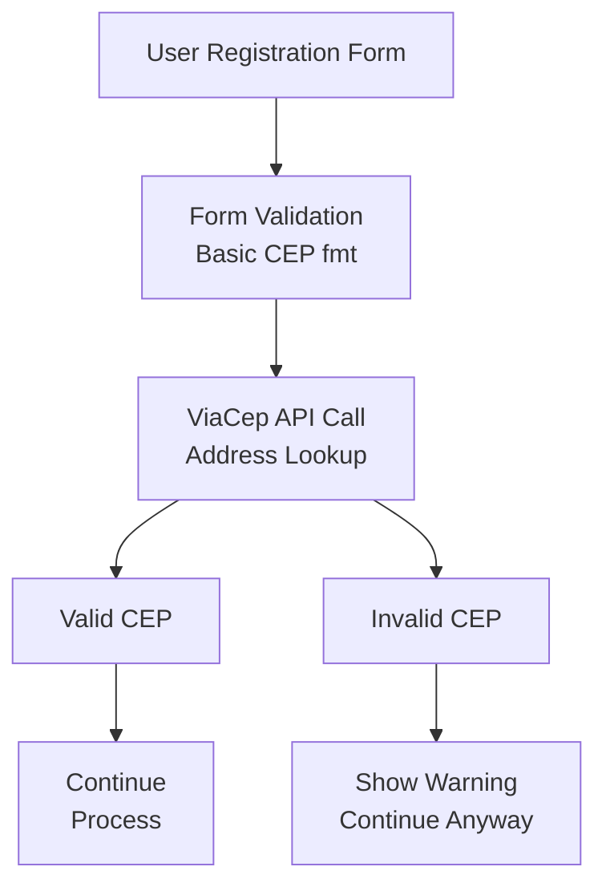
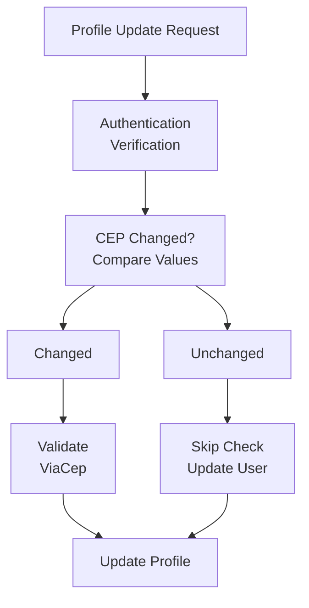
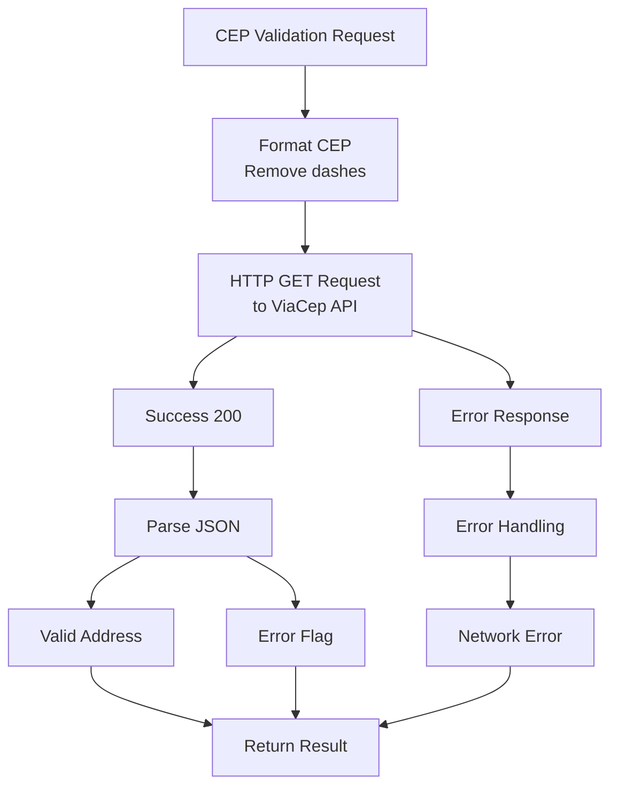

# Address Validation Feature

## Overview

The Address Validation feature provides Brazilian postal code (CEP) verification through integration with the ViaCep API. This feature ensures data quality during user registration and profile updates by validating addresses and retrieving standardized address information.

## Feature Purpose

Address Validation enables:
- Verification of Brazilian postal codes (CEP) during user registration
- Standardization of address data format
- Enhanced data quality and user experience
- Compliance with Brazilian address standards
- Graceful handling of address validation failures

This feature improves data integrity and provides a better user experience by ensuring valid addresses while maintaining system reliability even when external services are unavailable.

## Architecture Integration

### Integration Context


### Feature Flow Diagram


## Key Workflows

### 1. CEP Validation During Registration



**Input/Output:**
- **Input**: CEP string (e.g., "12345678" or "12345-678")
- **Output**: Address details or validation error
- **Fallback**: Registration continues even if validation fails

### 2. Profile Update CEP Validation



### 3. ViaCep API Integration Workflow



## Implementation Details

### Core Components

#### 1. ViaCep Client (`lib/quebrado_bank/via_cep/client.ex`)
HTTP client for ViaCep API integration using Tesla.

```elixir
defmodule QuebradoBank.ViaCep.Client do
  use Tesla

  plug Tesla.Middleware.BaseUrl, "https://viacep.com.br/ws"
  plug Tesla.Middleware.JSON

  def call(cep) do
    "/#{cep}/json"
    |> get()
    |> handle_response()
  end

  defp handle_response({:ok, %Tesla.Env{status: 200, body: %{"erro" => true}}}) do
    {:error, :not_found}
  end

  defp handle_response({:ok, %Tesla.Env{status: 200, body: body}}) do
    {:ok, body}
  end

  defp handle_response({:ok, %Tesla.Env{status: 400}}) do
    {:error, :bad_request}
  end

  defp handle_response({:error, _}) do
    {:error, :internal_server_error}
  end
end
```

#### 2. ViaCep Behaviour (`lib/quebrado_bank/via_cep/behaviour.ex`)
Defines contract for testing and mocking.

```elixir
defmodule QuebradoBank.ViaCep.Behaviour do
  @callback call(String.t()) :: {:ok, map()} | {:error, atom()}
end
```

#### 3. Integration in User Management
Address validation is integrated into user creation and update workflows.

```elixir
# In user registration process
def create_user(params) do
  with {:ok, validated_params} <- validate_basic_fields(params),
       {:ok, _address_info} <- validate_cep(params["cep"]) do
    # CEP is valid, proceed with user creation
    create_user_record(validated_params)
  else
    {:error, cep_error} ->
      # Log warning but continue registration
      Logger.warn("CEP validation failed: #{inspect(cep_error)}")
      create_user_record(params)
  end
end
```

### API Integration

#### ViaCep API Endpoint
```
GET https://viacep.com.br/ws/{cep}/json
```

**Example Request:**
```http
GET https://viacep.com.br/ws/01310100/json
```

**Success Response:**
```json
{
  "cep": "01310-100",
  "logradouro": "Avenida Paulista",
  "complemento": "",
  "bairro": "Bela Vista",
  "localidade": "São Paulo",
  "uf": "SP",
  "ibge": "3550308",
  "gia": "1004",
  "ddd": "11",
  "siafi": "7107"
}
```

**Error Response (Invalid CEP):**
```json
{
  "erro": true
}
```

### Error Response Handling

#### Client-Side Error Mapping
```elixir
defp handle_response({:ok, %Tesla.Env{status: 200, body: %{"erro" => true}}}) do
  {:error, :not_found}  # Invalid CEP
end

defp handle_response({:ok, %Tesla.Env{status: 400}}) do
  {:error, :bad_request}  # Malformed CEP format
end

defp handle_response({:error, _}) do
  {:error, :internal_server_error}  # Network/service error
end
```

#### Application Error Handling
```elixir
# Graceful degradation pattern
case ViaCep.Client.call(cep) do
  {:ok, address_data} ->
    Logger.info("CEP validated successfully: #{cep}")
    proceed_with_address_data(address_data)
    
  {:error, :not_found} ->
    Logger.warn("Invalid CEP provided: #{cep}")
    proceed_with_warning("CEP not found but continuing registration")
    
  {:error, reason} ->
    Logger.error("ViaCep service error: #{inspect(reason)}")
    proceed_with_fallback("Address validation temporarily unavailable")
end
```

## Business Logic Integration

### User Registration Integration
```elixir
def create_user(user_params) do
  # Step 1: Basic validation
  changeset = User.changeset(user_params)
  
  if changeset.valid? do
    # Step 2: CEP validation (optional enhancement)
    case validate_address(user_params["cep"]) do
      {:ok, address} ->
        # Could store additional address data
        create_user_with_address(changeset, address)
        
      {:error, _reason} ->
        # Continue without address details
        create_user_basic(changeset)
    end
  else
    {:error, changeset}
  end
end
```

### Profile Update Integration
```elixir
def update_user(user, update_params) do
  changeset = User.changeset(user, update_params)
  
  # Check if CEP is being updated
  if changeset.changes[:cep] do
    new_cep = changeset.changes.cep
    
    case validate_address(new_cep) do
      {:ok, _address} ->
        Repo.update(changeset)
        
      {:error, reason} ->
        # Add warning but allow update
        Logger.warn("CEP validation failed during update: #{inspect(reason)}")
        Repo.update(changeset)
    end
  else
    # No CEP change, normal update
    Repo.update(changeset)
  end
end
```

## External Service Management

### Service Reliability
- **Timeout Handling**: Tesla HTTP timeouts configured
- **Retry Logic**: Could be implemented for transient failures
- **Circuit Breaker**: Could be added for service protection
- **Fallback Strategy**: Always allow user operations to continue

### Performance Considerations
```elixir
# Async validation (potential enhancement)
def validate_cep_async(cep) do
  Task.async(fn -> ViaCep.Client.call(cep) end)
end

# Caching (potential enhancement)  
def validate_cep_cached(cep) do
  case get_cached_cep(cep) do
    nil -> 
      result = ViaCep.Client.call(cep)
      cache_cep_result(cep, result)
      result
    cached_result -> 
      cached_result
  end
end
```

### Rate Limiting Considerations
- **ViaCep Limits**: Public API with reasonable rate limits
- **Application Limits**: Could implement client-side rate limiting
- **Batch Validation**: Not currently needed but could be added

## Testing Strategy

### Unit Testing
```elixir
defmodule QuebradoBank.ViaCep.ClientTest do
  use ExUnit.Case
  import Mox

  setup :verify_on_exit!

  test "valid CEP returns address data" do
    expect(ViaCepMock, :call, fn "01310100" ->
      {:ok, %{
        "cep" => "01310-100",
        "logradouro" => "Avenida Paulista",
        "localidade" => "São Paulo",
        "uf" => "SP"
      }}
    end)

    assert {:ok, address} = ViaCep.Client.call("01310100")
    assert address["localidade"] == "São Paulo"
  end

  test "invalid CEP returns error" do
    expect(ViaCepMock, :call, fn "00000000" ->
      {:error, :not_found}
    end)

    assert {:error, :not_found} = ViaCep.Client.call("00000000")
  end
end
```

### Integration Testing
```elixir
# User registration with CEP validation
test "user registration with valid CEP" do
  Tesla.Mock.mock(fn
    %{method: :get, url: "https://viacep.com.br/ws/01310100/json"} ->
      %Tesla.Env{status: 200, body: valid_address_response()}
  end)

  params = %{
    "name" => "Test User",
    "email" => "test@example.com", 
    "password" => "password123",
    "cep" => "01310100"
  }

  assert {:ok, user} = Users.create(params)
  assert user.cep == "01310100"
end
```

### Mock Configuration
```elixir
# config/test.exs
config :quebrado_bank, :via_cep_client, QuebradoBank.ViaCep.ClientMock

# In test setup
defmock(QuebradoBank.ViaCep.ClientMock, for: QuebradoBank.ViaCep.Behaviour)
```

## Error Handling and Edge Cases

### Network Errors
```elixir
# Handle various network failure scenarios
case ViaCep.Client.call(cep) do
  {:ok, address} -> handle_success(address)
  {:error, :timeout} -> handle_timeout()
  {:error, :connection_failed} -> handle_connection_error()
  {:error, :service_unavailable} -> handle_service_down()
end
```

### Invalid Input Handling
```elixir
# CEP format validation before API call
def validate_cep_format(cep) do
  cep_digits = String.replace(cep, ~r/\D/, "")
  
  cond do
    String.length(cep_digits) != 8 -> {:error, :invalid_format}
    not Regex.match?(~r/^\d{8}$/, cep_digits) -> {:error, :invalid_characters}
    true -> {:ok, cep_digits}
  end
end
```

### Graceful Degradation Examples
```elixir
# User registration continues despite validation failure
def create_user_with_cep_validation(params) do
  case validate_address(params["cep"]) do
    {:ok, address_data} ->
      # Enhanced registration with address details
      create_user_enhanced(params, address_data)
      
    {:error, _reason} ->
      # Standard registration with warning
      Logger.warn("CEP validation unavailable, proceeding with basic registration")
      create_user_basic(params)
  end
end
```

## Monitoring and Metrics

### Service Health Metrics
- **API Success Rate**: Percentage of successful ViaCep calls
- **Response Times**: API response time tracking
- **Error Rates**: Types and frequency of API errors
- **Fallback Usage**: How often graceful degradation is used

### Business Metrics
- **CEP Validation Coverage**: Percentage of users with validated addresses
- **Invalid CEP Rate**: Frequency of invalid CEP inputs
- **Geographic Distribution**: User distribution by validated addresses

## Future Enhancements

### Near-Term Improvements
1. **Address Data Storage**: Store full address details from ViaCep
2. **Address Suggestions**: Provide address completion features
3. **CEP Format Auto-correction**: Automatic CEP formatting
4. **Batch Validation**: Validate multiple CEPs efficiently

### Advanced Features
1. **Multiple Address Providers**: Backup address validation services
2. **Address Change Tracking**: History of address updates
3. **Geographic Services**: Distance calculation, location services
4. **International Addresses**: Support for non-Brazilian addresses

### Technical Improvements
1. **Caching Layer**: Cache validated CEPs for performance
2. **Rate Limiting**: Client-side rate limiting for API protection
3. **Async Validation**: Non-blocking address validation
4. **Monitoring Integration**: Advanced service monitoring

## Configuration

### Environment Configuration
```elixir
# config/config.exs
config :quebrado_bank, :via_cep,
  base_url: "https://viacep.com.br/ws",
  timeout: 5_000,
  retries: 3

# config/test.exs  
config :quebrado_bank, :via_cep_client, QuebradoBank.ViaCep.ClientMock

# config/prod.exs
config :quebrado_bank, :via_cep,
  timeout: 3_000,
  retries: 2
```

### Feature Flags
```elixir
# config/runtime.exs
config :quebrado_bank, :features,
  cep_validation_enabled: System.get_env("CEP_VALIDATION_ENABLED", "true") == "true",
  cep_validation_required: System.get_env("CEP_VALIDATION_REQUIRED", "false") == "true"
```

## Related Documentation

- [User Management](user-management.md) - CEP validation in user workflows
- [External Integrations](../integrations.md) - ViaCep API integration details
- [Business Logic](../business-logic.md) - Address validation business rules
- [Architecture Overview](../architecture.md) - External service integration patterns