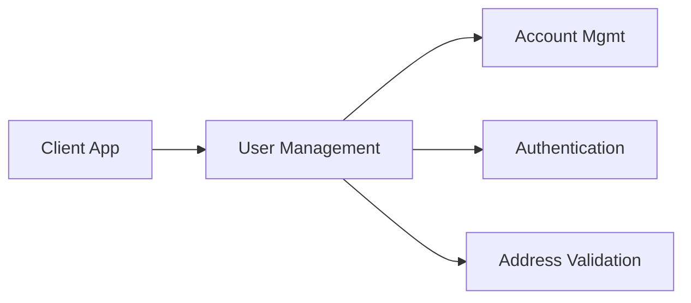
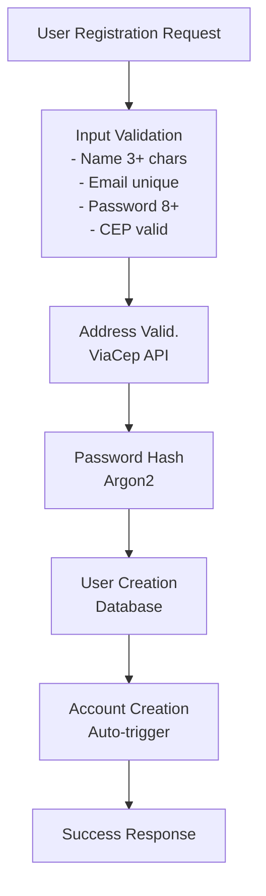
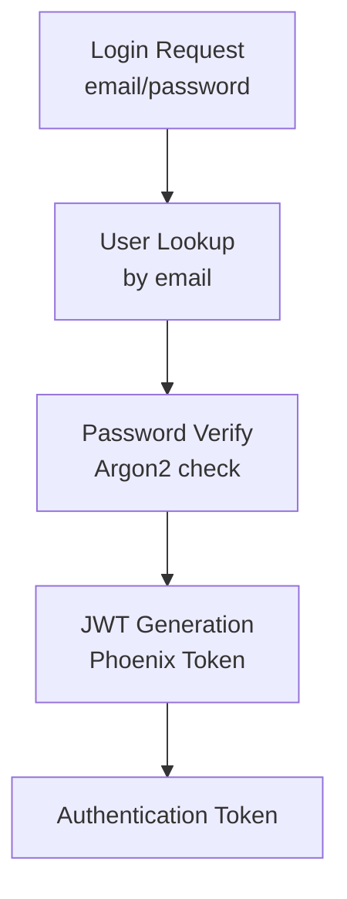
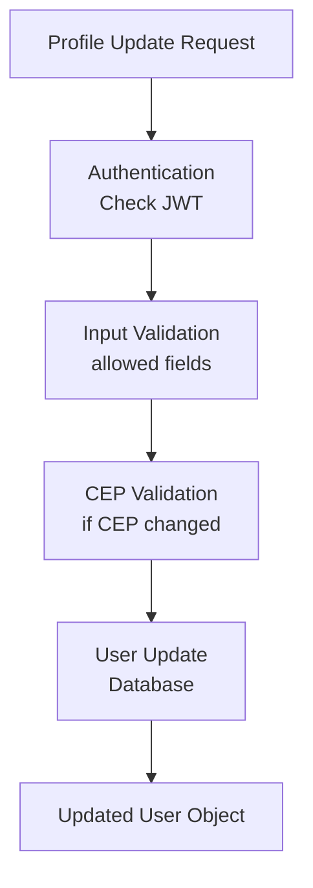
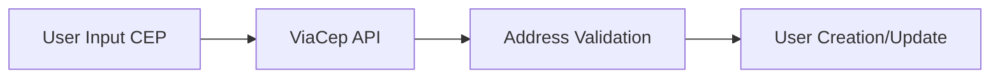

# User Management Feature

## Overview

The User Management feature handles the complete user lifecycle in QuebradoBank, from registration to account deletion. It provides secure user authentication, profile management, and serves as the foundation for all other system features.

## Feature Purpose

User Management enables customers to:
- Create new accounts in the QuebradoBank system
- Authenticate securely to access banking services
- Manage and update their personal profile information
- Close their accounts when needed

This feature is essential for customer onboarding, security, and regulatory compliance.

## Architecture Integration

### System Context


### Dependencies
- **Database**: PostgreSQL for user data persistence
- **External APIs**: ViaCep for address validation
- **Security**: Argon2 for password hashing
- **Authentication**: Phoenix Token for JWT generation

## Key Workflows

### 1. User Registration Workflow



**Input/Output:**
- **Input**: `name`, `email`, `password`, `cep`
- **Output**: Created user object (excluding password)
- **Error Cases**: Validation failures, duplicate email, external API failures

### 2. User Authentication Workflow



**Input/Output:**
- **Input**: `email`, `password`
- **Output**: JWT token for API authentication
- **Error Cases**: User not found, invalid password

### 3. Profile Update Workflow



**Input/Output:**
- **Input**: `name`, `email`, `cep` (password updates not supported yet)
- **Output**: Updated user object
- **Error Cases**: Validation failures, unauthorized access

## Implementation Details

### Core Components

#### 1. User Schema (`lib/quebrado_bank/users/user.ex`)
```elixir
schema "users" do
  field(:name, :string)           # User's full name
  field(:email, :string)          # Unique email address
  field(:password_hash, :string)  # Argon2 hashed password
  field(:password, :string, virtual: true)  # Virtual field for input
  field(:cep, :string)            # Brazilian postal code
  has_one(:account, Account)      # 1:1 relationship with account
  timestamps()
end
```

#### 2. Context Module (`lib/quebrado_bank/users.ex`)
Provides clean interface for all user operations:
- `create/1` - User registration
- `get/1` - User lookup by ID
- `update/1` - Profile updates
- `delete/1` - Account deletion
- `login/1` - Authentication

#### 3. Individual Operation Modules
- `QuebradoBank.Users.Create` - Registration logic
- `QuebradoBank.Users.Get` - User retrieval
- `QuebradoBank.Users.Update` - Profile management
- `QuebradoBank.Users.Delete` - Account closure
- `QuebradoBank.Users.Verify` - Authentication

### API Endpoints

#### User Registration
```http
POST /api/users
Content-Type: application/json

{
  "name": "John Doe",
  "email": "john@example.com", 
  "password": "securepass123",
  "cep": "12345678"
}
```

**Response (Success):**
```json
{
  "name": "John Doe",
  "email": "john@example.com",
  "cep": "12345-678"
}
```

#### User Authentication
```http
POST /api/users/login
Content-Type: application/json

{
  "email": "john@example.com",
  "password": "securepass123"
}
```

**Response (Success):**
```json
{
  "token": "eyJhbGciOiJIUzI1NiIs...",
  "user": {
    "name": "John Doe",
    "email": "john@example.com",
    "cep": "12345-678"
  }
}
```

#### Profile Management
```http
GET /api/users/:id
Authorization: Bearer <jwt_token>

PUT /api/users/:id
Authorization: Bearer <jwt_token>
Content-Type: application/json

{
  "name": "John Updated",
  "cep": "87654321"
}
```

## External Integrations

### ViaCep API Integration
**Purpose**: Validates Brazilian postal codes during registration and updates

**Integration Flow:**


**Handling:**
- **Success**: Address data available for future use
- **Failure**: Registration continues with warning (graceful degradation)
- **Testing**: Mocked for reliable test execution

### Database Integration
**Schema Constraints:**
- Unique email addresses (database-level constraint)
- Required fields enforced at application and database levels
- Foreign key relationships with accounts table

## Security Considerations

### Password Security
- **Hashing**: Argon2 algorithm with salt
- **Storage**: Never store plain text passwords
- **Validation**: Minimum 8 character requirement
- **Updates**: Password changes require separate secure workflow (not yet implemented)

### Data Privacy
- **Field Hiding**: Password hash hidden from JSON serialization
- **Access Control**: Users can only access their own data
- **Audit Trail**: User modifications tracked via timestamps

### Authentication Security
- **JWT Tokens**: Stateless authentication tokens
- **Token Expiration**: Configurable token lifetime
- **Bearer Token**: Standard Authorization header format

## Edge Cases and Error Handling

### Registration Edge Cases
1. **Duplicate Email**: Returns clear error message
2. **Invalid CEP**: ViaCep API failure handled gracefully
3. **Weak Password**: Client-side and server-side validation
4. **Network Issues**: External API timeouts handled

### Authentication Edge Cases
1. **Account Not Found**: Generic error for security
2. **Wrong Password**: Generic error for security
3. **Expired Token**: Clear expiration message
4. **Malformed Token**: Invalid token error

### Profile Update Edge Cases
1. **Unauthorized Access**: JWT validation failure
2. **Email Conflicts**: Duplicate email detection
3. **Invalid CEP Update**: Address validation failure
4. **Partial Updates**: Only provided fields updated

## Testing Strategy

### Unit Testing
- **User Schema**: Changeset validation testing
- **Context Functions**: Business logic testing
- **External APIs**: Mocked using Mox library
- **Password Hashing**: Argon2 integration testing

### Integration Testing
- **API Endpoints**: Full request/response cycle testing
- **Database Integration**: Real database transaction testing
- **Authentication Flow**: End-to-end auth testing

## Future Enhancements

### Near-Term Improvements
1. **Password Updates**: Secure password change workflow
2. **Email Verification**: Email confirmation for registration
3. **Account Recovery**: Password reset functionality
4. **Profile Pictures**: User avatar upload and management

### Advanced Features
1. **Two-Factor Authentication**: SMS or app-based 2FA
2. **Social Login**: OAuth integration with Google/Facebook
3. **Account Verification**: KYC (Know Your Customer) compliance
4. **Activity Logging**: Detailed user action audit trail

## Related Documentation

- [Authentication & Authorization](authentication.md) - JWT token management
- [Account Management](account-management.md) - User-account relationships
- [Address Validation](address-validation.md) - ViaCep integration details
- [Architecture Overview](../architecture.md) - System design context